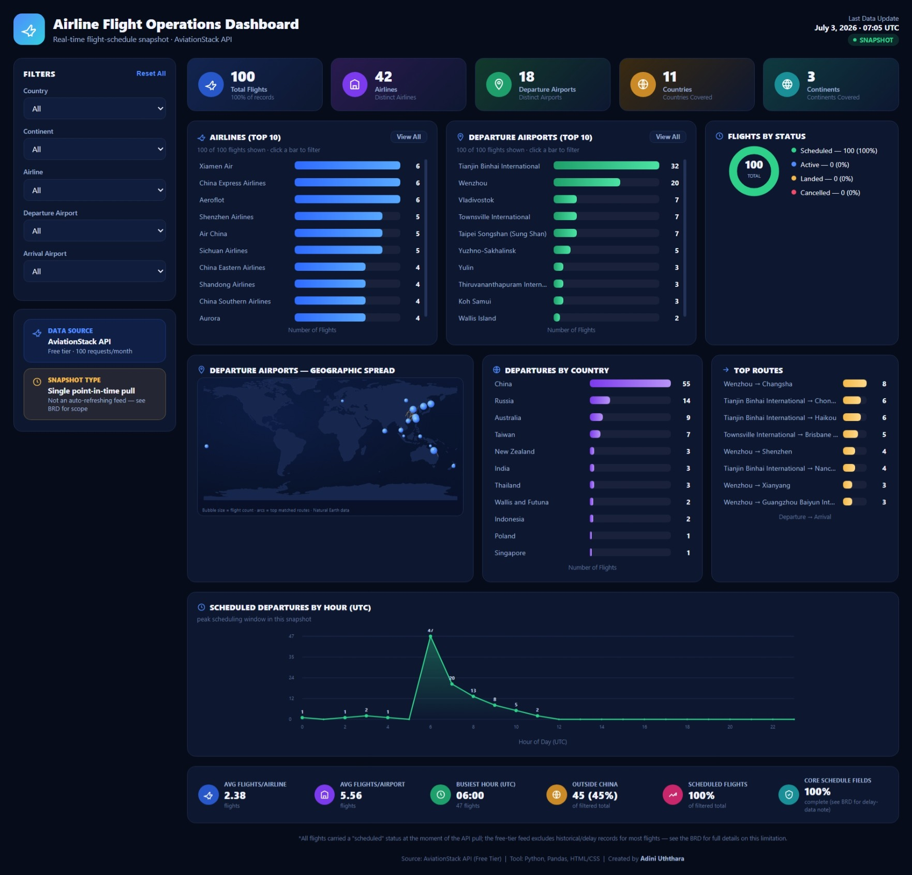

# 🛫✈️ Airline Flight Operations Dashboard

🚀 A real-time flight schedule analysis project built to practice an end-to-end Business Analyst workflow — from live API data extraction to cleaning, analysis, documentation, and dashboard creation.

---

## 📌 Project Overview

This project simulates a real-world airline operations analytics system using live flight data.

It covers the full workflow:

🌐 Data Extraction → 🧹 Data Cleaning → 📊 Analysis → 📈 Visualization → 📝 Business Documentation

---

## ⚙️ What this project does

1. 🌍 **Pulls live flight data** from the [AviationStack API](https://aviationstack.com/) using Python  
2. 🐍 **Cleans and analyzes data** using pandas  
   - Top airlines ✈️  
   - Busiest departure airports 🛫  
   - Flight status breakdown 📡  
3. 📊 **Visualizes insights in two formats:**
   - Power BI Dashboard 📈  
   - Custom HTML/CSS Dashboard 🌐  
4. 📝 **Documents full business context (BRD):**
   - Objectives 🎯  
   - Scope 📌  
   - Methodology ⚙️  
   - Key Findings 📊  
   - Data Limitations ⚠️  

---

## 💡 Why I built it this way

Real-world data is rarely perfect.

⚠️ The free-tier AviationStack API only provided limited “scheduled” flight data with almost no delay information.

Because of this:

- ❌ On-time performance analysis was not possible  
- ✅ Instead of guessing, the limitation was clearly documented in the BRD  

👉 This demonstrates a key Business Analyst principle: **transparency over assumptions**

---

## 📊 Key Findings

| 📌 Metric | 📈 Value |
|----------|--------|
| ✈️ Total flights captured | 100 |
| 🏢 Distinct airlines | 42 |
| 🛫 Distinct departure airports | 18 |
| 🔥 Busiest departure airport | Tianjin Binhai International (32%) |

---

## 📁 Files in this repo

| 📄 File | 🧾 Description |
|------|------|
| flight_data.py | Pulls real-time flight data from AviationStack API |
| analyze.py | Performs data analysis using pandas |
| flight_data.csv | Raw dataset captured from API |
| flight_operations_dashboard.html | Interactive dashboard (HTML/CSS) |
| [BRD Document](./BRD_Airline_Flight_Dashboard.pdf) | Full Business Requirements Document |

---

## 📊 Dashboard Preview

### 🌐 Flight Operations Dashboard

---

## 🛠 Tools Used

🐍 Python (`requests`, `pandas`)  
🌐 AviationStack API  
📊 Power BI  
🎨 HTML / CSS  
📝 Business Analysis (BRD)

---

## ⚠️ Notes

- 🔐 API keys are stored in `.env` file (not included in repo)  
- ⛔ Free API limitations:
  - 100 requests/month  
  - No historical flight data  
- 📌 Full limitations are documented in the BRD  

---

## 🚀 Outcome

This project demonstrates:

✔️ Real-time API integration  
✔️ Data cleaning & analysis  
✔️ Dashboard creation  
✔️ Business documentation (BRD)  
✔️ Handling real-world data limitations responsibly  
